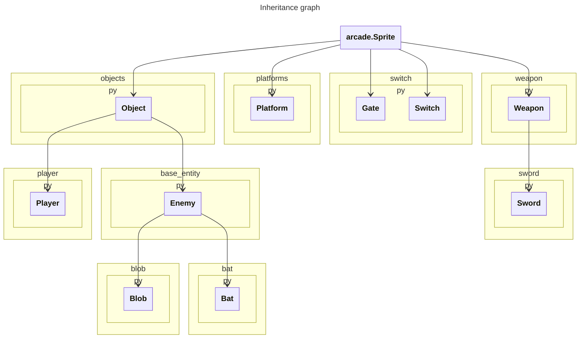

# Architecture des entités

## 1. Racine polymorphe : `Object`

`Object` étend `arcade.Sprite` et regroupe tout ce qu’une entité « vivante » doit posséder :

* **Points de vie**, barre de vie embarquée.  
* **Invincibilité** temporaire.  
* Méthodes génériques `take_damage()`, `heal()`, `on_death()`, etc.

Ainsi, n’importe quelle sous-classe hérite gratuitement de ces capacités ; le même appel `sprite.take_damage(10)` fonctionne autant sur le joueur que sur un *Blob* ou une *Bat*.

---

## 2. Ennemis (`Enemy`, `Blob`, `Bat`)

| Classe | Rôle | Spécificités |
|--------|------|--------------|
| `Enemy` | Abstraction d’IA | Ajoute vitesse, direction, inversion (*reversy*) et surtout la **méthode abstraite** `step(dt)` que chaque ennemi redéfinit. |
| `Blob` | Marcheur au sol | Redéfinit `step()` pour marcher en sécurité : prédiction de terrain + détection de mur. |
| `Bat`  | Volant erratique | Redéfinit `step()` pour fournir un vol aléatoire dans un rayon donné. |

Dans la boucle de jeu (`GameView.on_update`), `monster_list` est typée `SpriteList[Enemy]`. Un simple appel `monster_list.update(dt)` déclenche la bonne version de `step()` pour chaque type d’ennemi.

---

## 3. Joueur (`Player`)

`Player` dérive également de `Object`. Il réutilise santé / invincibilité puis ajoute :

* **Constantes de mouvement** (vitesse, saut, buffering).  
* **Knock-back** : recul horizontal + vertical, qui remet à zéro les vitesses internes.  

L’API reste cohérente : on appelle toujours `take_damage()` ou `heal()` même pour le joueur.

---

## 4. Armes (`Weapon`, `Sword`)

`Weapon` hérite directement d’`arcade.Sprite` et encapsule la **géométrie d’un objet pivotant autour de la main** : texture, pivot, offsets.  

* `Sword` montre un premier cas concret (arme de mêlée).  
* Les futures armes n’auront qu’à fournir la texture et les paramètres de pivot ; le jeu manipule une liste générique `SpriteList[Weapon]` sans connaître le détail de chaque arme.

---

## 5. Environnement interactif

### Plateformes mobiles : `Platform`

* **Typing** : signatures explicites (`Tuple[float, float]`, `str`, `bool`) donnent à *mypy* un contrat clair.  
* **Design** : axe de déplacement (“x” ou “y”), sens et deux bornes ; un bloc de plusieurs tiles devient un simple groupe de `Platform`.  
* **Polymorphisme** : dans `LevelBuilder`, la liste `platforms` est de type `SpriteList[Platform]`, puis concaténée à `wall_list` (`SpriteList[Sprite]`). Pour le moteur, une plateforme est donc « un mur qui bouge ».

### Portes & leviers : `Gate`, `Switch`

Simples `arcade.Sprite` gérant leur état (ouvert/fermé) ; un `Switch` référence une ou plusieurs `Gate` à déclencher.

---

## 6. Fabrication & chargement de niveau

* **`LevelBuilder`** agrège des `SpriteList` hétérogènes (murs, monstres, switches…) puis les renvoie via un `TypedDict`.  
  * Le code consommateur applique seulement les opérations offertes par la **classe de base** (`Sprite`) ; il n’a pas à distinguer la sous-classe précise.  
* **`platform_build`** et **`map_loader`** restent fonctionnels : ils génèrent les instances concrètes mais ne participent pas eux-mêmes à la hiérarchie.

---

## 7. Diagramme d’héritage

## Analyse de l'influence du nombre de chauves-souris
Ces tests de benchmarking ont été faits avec une machine relativement puissante : un **MacBook M4 Pro** muni de bonnes specs.
Les mesures montrent que le **temps de chargement** demeure quasi constant tant que le nombre de chauve-souris reste inférieur à quelques milliers : il ne passe que de **0,10 s** à **0,27 s** entre 1 et 1 000 000 sprites. Cela suggère qu’un coût fixe (initialisation de la vue, chargement des textures) masque pour l’instant la boucle d’instanciation en Θ(N).  
À l’inverse, le **temps moyen d’un `on_update()`** croît presque linéairement — pente ≈ 0,78 — conformément au Θ(N) attendu : chaque chauve-souris exécute son IA puis quatre tests de collision accélérés par le spatial-hash d’Arcade.  
En pratique, un niveau contenant jusqu’à **10 000** chauve-souris maintient **≈ 140 fps** sur la machine de test ; au-delà, on recommande de plafonner la population ou de simplifier l’IA hors-écran afin de préserver la fluidité.

| √N (k) | N chauve-souris | Temps de chargement (s) |
|:------:|---------------:|------------------------:|
| 1      | 1         | 0,1011 |
| 3      | 9         | 0,1011 |
| 5      | 25        | 0,1031 |
| 10     | 100       | 0,1019 |
| 50     | 2 500     | 0,1064 |
| 100    | 10 000    | 0,1196 |
| 500    | 250 000   | 0,1647 |
| 1 000  | 1 000 000 | 0,2738 |

| √N (k) | N chauve-souris | Temps moyen `on_update()` (s) |
|:------:|---------------:|------------------------------:|
| 1      | 1         | 3,55 × 10⁻⁴ |
| 3      | 9         | 4,97 × 10⁻⁴ |
| 5      | 25        | 8,38 × 10⁻⁴ |
| 10     | 100       | 9,55 × 10⁻⁴ |
| 50     | 2 500     | 3,64 × 10⁻³ |
| 100    | 10 000    | 6,89 × 10⁻³ |
| 500    | 250 000   | 3,38 × 10⁻² |
| 1 000  | 1 000 000 | 6,70 × 10⁻² |

## Analyse de l’influence du nombre de **murs fixes**

### Observation générale
* **Chargement** : Le temps augmente pratiquement linéairement avec le nombre de murs. En-dessous de 1 000 murs le coût reste dominé par l’initialisation (≈ 0,06 s – 0,10 s). Au-delà, la courbe devient clairement Θ(N) : on passe à **0,48 s** pour 10 000 murs puis **4,25 s** pour 100 000.
* **`on_update()`** : Le temps reste presque constant (≈ 0,3 ms) jusqu’à 1 000 murs, puis plafonne autour de **2,5 ms** même à 100 000 murs. Cela confirme la complexité **Θ(1)** attendue : le spatial-hash d’Arcade permet de retrouver les collisions sol / murs dans un temps indépendant de N.

### Interprétation
| Phase | Complexité théorique | Résultat mesuré | Commentaire |
|-------|---------------------|-----------------|-------------|
| Chargement | Θ(N) | N¹·⁰ | Chaque mur engendre la création d’un sprite ; la pente ≈ 1 est visible dès que temps initial fixe (< 0,06 s) devient négligeable. |
| `on_update()` | Θ(1) | N⁰·¹ (≈ plateau) | Légère dérive (peut-être dûe au processus de hash interne?), mais toujours proche de constant. |

### Tableau des mesures

| Nombre de murs | Temps de chargement&nbsp;(s) | Temps moyen `on_update()`&nbsp;(s) |
|---------------:|----------------------------:|-----------------------------------:|
| 1         | 0,0964 | 3,21 × 10⁻⁴ |
| 10        | 0,0625 | 3,03 × 10⁻⁴ |
| 50        | 0,0638 | 3,97 × 10⁻⁴ |
| 100       | 0,0665 | 3,86 × 10⁻⁴ |
| 500       | 0,0830 | 9,02 × 10⁻⁴ |
| 1 000     | 0,1038 | 9,57 × 10⁻⁴ |
| 5 000     | 0,2558 | 2,46 × 10⁻³ |
| 10 000    | 0,4798 | 2,53 × 10⁻³ |
| 100 000   | 4,2463 | 2,51 × 10⁻³ |

### Conclusion
La phase de chargement respecte pleinement la croissance linéaire attendue ; la dérive quasi nulle du `on_update()` prouve l’efficacité du spatial-hash pour la détection de collisions statiques. En pratique, même avec **10 000 murs** le jeu reste largement sous le seuil des 16 ms/frame (60 fps), et jusqu’à **100 000** murs nous restons à ~2,5 ms par mise-à-jour, laissant une confortable marge pour la logique de gameplay supplémentaire.
